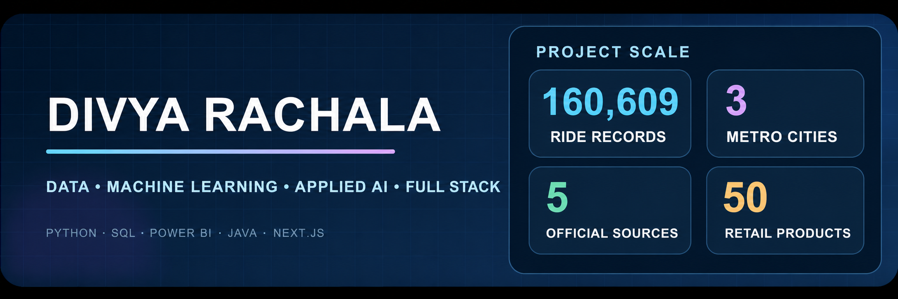
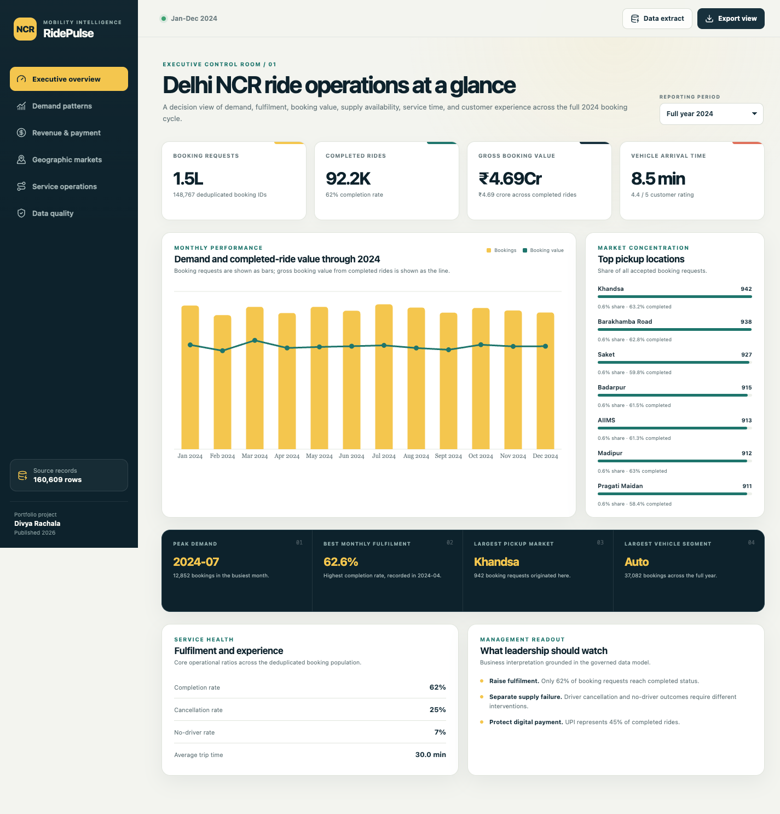
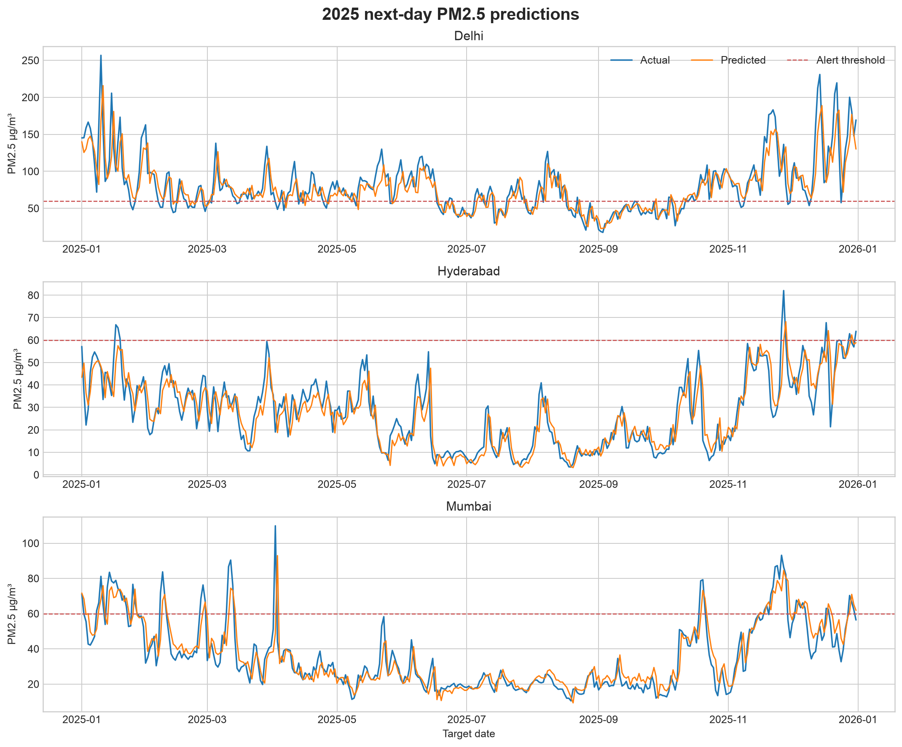
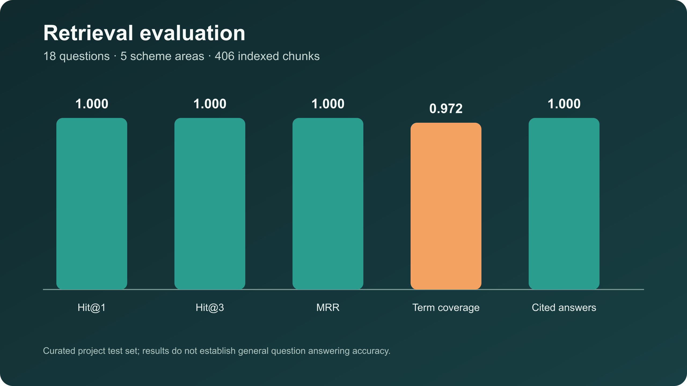
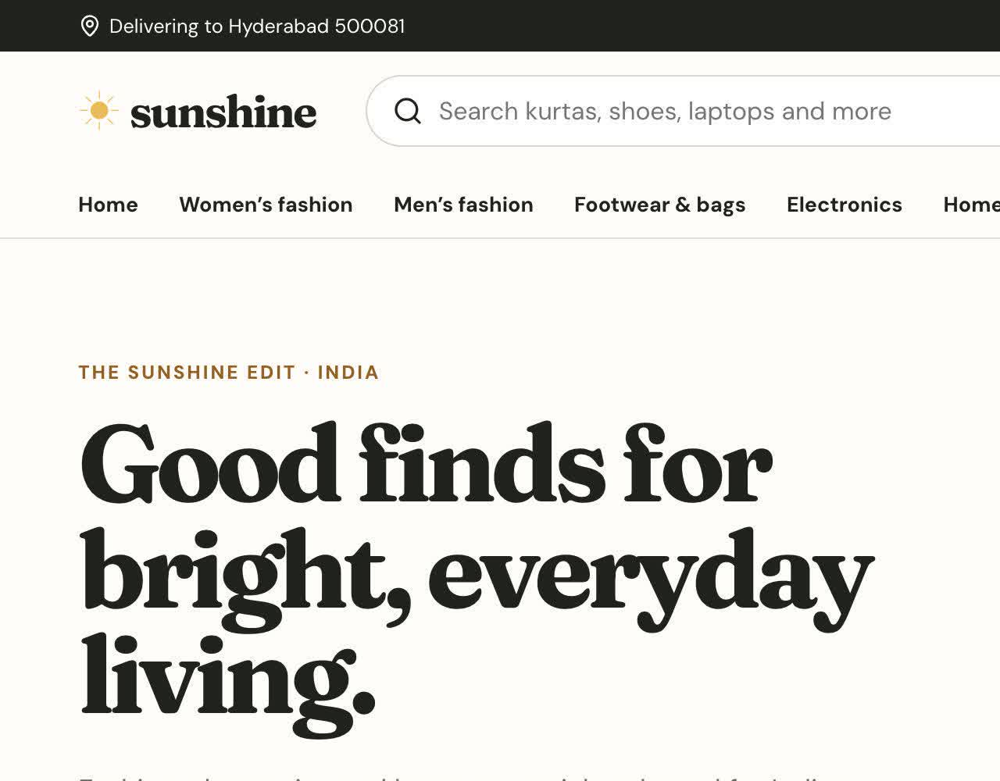

  

  <a href="#selected-projects">Selected projects</a> ·
  <a href="#toolkit">Toolkit</a> ·
  <a href="#how-i-build">How I build</a> ·
  <a href="#education">Education</a> ·
  <a href="#connect">Connect</a>

  
  
  

I am Divya, a Computer Science graduate who enjoys taking a project from an unclear question to a result that can be inspected and reproduced. My work spans data preparation, KPI design, machine learning, retrieval systems, APIs and customer facing applications. The projects below focus on Indian transport, air quality, agriculture and retail.

<table>
  <tr>
    <td align="center"><strong>160,609</strong> ride records analysed</td>
    <td align="center"><strong>1,095</strong> unseen time ordered test rows</td>
    <td align="center"><strong>5</strong> official scheme sources</td>
    <td align="center"><strong>50</strong> retail catalogue products</td>
  </tr>
</table>

## Selected projects

### 01 · RidePulse Operations Analytics

  

| | |
| :--- | :--- |
| **Problem** | Repeated booking rows and outcome dependent fields caused operational KPIs to disagree. |
| **Approach** | I cleaned and deduplicated the booking file, defined governed KPIs in SQL, built DuckDB marts, and prepared a six page Power BI implementation package. |
| **Evidence** | 160,609 source rows became 148,767 unique bookings after 11,842 duplicates were removed. All 12 warehouse checks pass. |
| **Stack** | Python · SQL · DuckDB · Parquet · Power BI |

<a href="https://github.com/divyarachala1812/ridepulse-operations-analytics"><strong>Repository</strong></a> · <a href="https://github.com/divyarachala1812/ridepulse-operations-analytics/blob/main/reports/RidePulse_Report.pdf"><strong>PDF report</strong></a>

 

### 02 · AirWise Metro Forecasting

  

| | |
| :--- | :--- |
| **Problem** | Random validation can leak nearby dates and overstate the reliability of a pollution forecast. |
| **Approach** | I built a next day PM2.5 model for Delhi, Hyderabad and Mumbai using chronological validation, a persistence baseline, Ridge regression and city level error analysis. |
| **Evidence** | The 3,747 row city day panel contains 1,095 unseen test rows. Ridge achieved 8.50 µg/m³ MAE, 0.851 R² and 0.871 alert recall on 2025 data. |
| **Stack** | Python · pandas · scikit learn · time series validation · Matplotlib |

<a href="https://github.com/divyarachala1812/airwise-metro-forecasting"><strong>Repository</strong></a> · <a href="https://github.com/divyarachala1812/airwise-metro-forecasting/blob/main/reports/AirWise_Report.pdf"><strong>PDF report</strong></a>

 

### 03 · KrishiGuide Scheme Assistant

  

| | |
| :--- | :--- |
| **Problem** | Farmer scheme details are distributed across official pages, PDFs, FAQs and circulars. |
| **Approach** | I created a citation first retrieval workflow over five official sources, with Hindi and Hinglish query handling, source grounded answers and visible evidence. |
| **Evidence** | The declared 18 question evaluation reached Hit@1 of 1.000, term coverage of 0.972 and citation completeness of 1.000. |
| **Stack** | Python · information retrieval · TF IDF · multilingual query handling · pytest |

<a href="https://github.com/divyarachala1812/krishiguide-scheme-assistant"><strong>Repository</strong></a> · <a href="https://github.com/divyarachala1812/krishiguide-scheme-assistant/blob/main/reports/KrishiGuide_Report.pdf"><strong>PDF report</strong></a>

 

### 04 · Sunshine Retail Platform

  

| | |
| :--- | :--- |
| **Problem** | Search, stock, payment, order history and customer support can become inconsistent when each part uses separate application state. |
| **Approach** | I connected a Next.js storefront to a Java Spring Boot order API, FastAPI recommendations and conversational support. The backend reserves or releases inventory and preserves typed evidence for every order outcome. |
| **Evidence** | The live application connects 50 products, six bounded backend components, eight delivery stages and three controlled checkout outcomes. All 26 TypeScript, JUnit and pytest checks pass. |
| **Stack** | Next.js · TypeScript · Java 17 · Spring Boot · Python · FastAPI · Vercel |

<a href="https://sunshine-agentic-retail.vercel.app"><strong>Live application</strong></a> · <a href="https://github.com/divyarachala1812/sunshine-retail-platform"><strong>Repository</strong></a> · <a href="https://github.com/divyarachala1812/sunshine-retail-platform/blob/main/output/pdf/Sunshine_Report.pdf"><strong>PDF report</strong></a>

## Toolkit

  

  
  
  
  
  
  

| Area | What I use it for |
| :--- | :--- |
| Data analysis | Python, pandas, SQL, DuckDB, Parquet and Power BI for cleaning, governed metrics and decision views |
| Machine learning | scikit learn, chronological validation, baseline comparison, feature importance and error analysis |
| Applied AI | Retrieval, ranking, citations, evaluation sets and safe fallback behaviour |
| Software | Java, Spring Boot, FastAPI, TypeScript, Next.js, REST APIs and automated tests |

## How I build

| 01 · Frame | 02 · Prepare | 03 · Validate | 04 · Communicate |
| :--- | :--- | :--- | :--- |
| Define the user, question, grain and success measure. | Preserve raw inputs, document assumptions and make transformations repeatable. | Test data contracts, compare baselines and inspect failure cases. | Publish the result with evidence, limitations, a clear README and a detailed report. |

I prefer honest project boundaries. Synthetic data is labelled, held out results are separated from training results, dashboards point to governed definitions, and AI outputs keep their sources visible.

## Education

**Bachelor of Technology in Computer Science**  
Malla Reddy Institute of Engineering and Technology · June 2026

## Connect

  

Every featured project includes reproducible code, evidence and a written project report.

